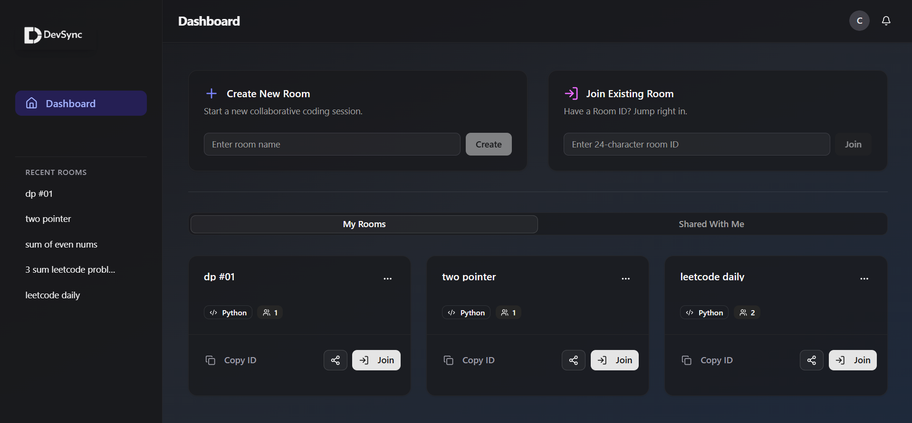

# DevSync: Collaborative Code Editor

A real-time, web-based collaborative code editor for Python, featuring live code execution, room-based collaboration, and Firebase authentication. Built with FastAPI, React, and Firebase.



---

## Features

- **Real-Time Collaboration:** Instantly sync code changes across all users in a room using WebSockets.
- **Room System:** Create or join coding rooms for focused collaboration.
- **Live Code Execution:** Run Python code on the server and view output in real time.
- **Authentication:** Secure login and registration with Firebase Auth.
- **Modern UI:** Clean, responsive interface built with React, Radix UI, and Tailwind CSS.
- **Scalable Backend:** FastAPI, MongoDB, and Uvicorn power the backend.

---

## Tech Stack

| Area        | Technology                                                      |
|-------------|-----------------------------------------------------------------|
| **Backend** | Python, FastAPI, Uvicorn, MongoDB, WebSockets, Firebase Admin   |
| **Frontend**| React, Vite, Monaco Editor, Radix UI, Tailwind CSS, Firebase JS |
| **Database**| MongoDB                                                         |
| **Auth**    | Firebase Authentication                                         |

---

## Project Structure

```
/
├── backend/
│   ├── src/
│   │   ├── api/          # API routes and endpoints
│   │   ├── core/         # Config, Firebase, Auth
│   │   ├── db/           # Database connection
│   │   ├── models/       # Pydantic models
│   │   ├── services/     # Business logic (code exec, websockets)
│   │   └── main.py       # FastAPI app entrypoint
│   └── requirements.txt  # Python dependencies
│
├── frontend/
│   ├── src/
│   │   ├── components/   # React components
│   │   ├── pages/        # Page components
│   │   ├── hooks/        # Custom React hooks
│   │   ├── lib/          # Firebase config, axios, utils
│   │   └── main.jsx      # Frontend entrypoint
│   └── package.json      # Node.js dependencies
│
└── README.md             # Project documentation
```

---

## Getting Started

### Prerequisites
- [Python 3.8+](https://www.python.org/)
- [Node.js 16+](https://nodejs.org/) (with npm or pnpm)
- [MongoDB](https://www.mongodb.com/try/download/community) instance running

### 1. Clone the Repository

```sh
git clone https://github.com/your-username/your-repo-name.git
cd your-repo-name
```

### 2. Backend Setup

```sh
cd backend
python -m venv venv
# On Windows:
venv\Scripts\activate
# On Mac/Linux:
# source venv/bin/activate
pip install -r requirements.txt
```

#### Backend Environment Variables
- `MONGO_DETAILS` (default: `mongodb://localhost:27017`)
- `FIREBASE_SERVICE_ACCOUNT_PATH` (path to your Firebase service account JSON)
- `GSHEET_CREDENTIALS_FILE` (if using Google Sheets integration)

You can set these in your shell or with a `.env` file (use [python-dotenv](https://pypi.org/project/python-dotenv/)).

#### Run the Backend

```sh
uvicorn src.main:app --reload --port 5000
```

### 3. Frontend Setup

```sh
cd frontend
pnpm install  # or npm install
```

#### Firebase Configuration
Edit `src/lib/firebase.js` with your Firebase project credentials. (These are currently hardcoded.)

#### (Optional) Frontend Environment Variables
If you want to use environment variables, create a `.env` file in `frontend/`:

```
# Example .env
VITE_API_BASE_URL=http://localhost:5000
VITE_WS_BASE_URL=ws://localhost:5000
```

#### Run the Frontend

```sh
pnpm dev  # or npm run dev
```

The app will be available at [http://localhost:5173](http://localhost:5173).

---

## How It Works

1. **Authentication:** Users sign up or log in with Firebase Auth. The frontend manages auth state and sends the JWT to the backend for verification.
2. **Room Management:** Users create or join rooms. Room data is stored in MongoDB.
3. **Real-Time Sync:** The frontend connects to the backend via WebSockets. Code changes are broadcast to all users in the room.
4. **Code Execution:** When a user runs code, it is sent to the backend, executed in a sandbox, and the result is broadcast to all room members.

---

## Contact

For questions or support, open an issue on GitHub. 